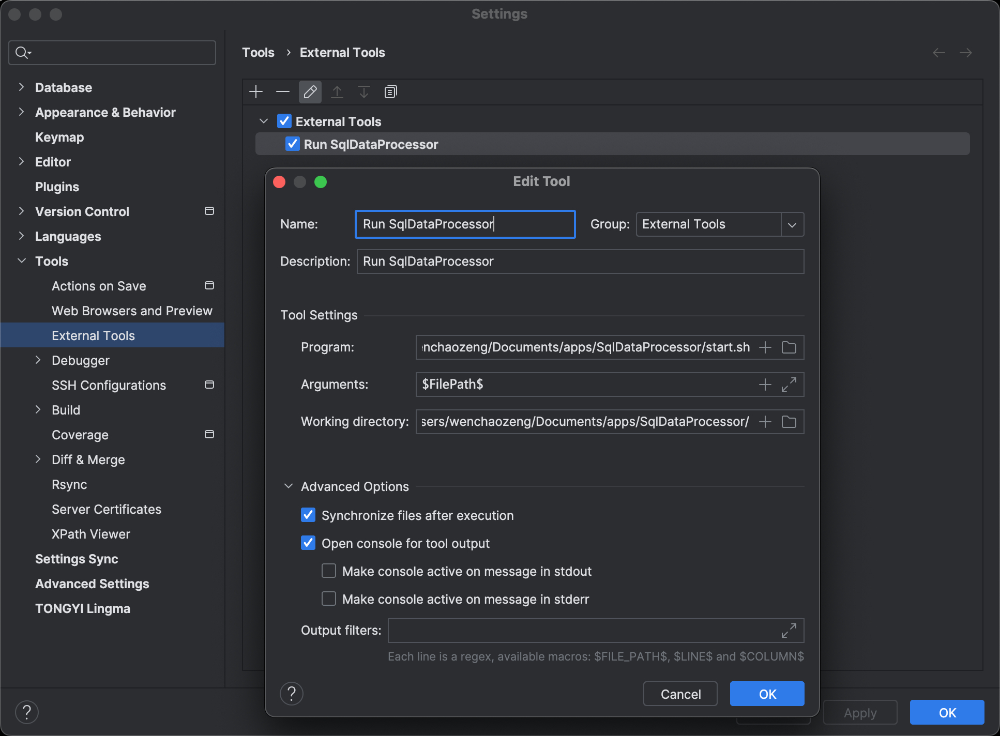

# SqlDataProcessor

一个基于SQL的数据处理工具, 可以通过写SQL的方式对excel, csv, json, 跨库MySQL表等进行数据处理和加工. 目前支持数据库: H2, MySQL, PostgreSQL, SQLite.

欢迎反馈问题, 提出建议, 或者贡献代码. :D

# 下载和运行

从 [releases](https://github.com/WenchaoZeng/SqlDataProcessor/releases) 里面下载最新的zip包, 解压到一个特定目录.

运行需要java 1.8版本以上运行时环境, 请使用下面命令来检查你是否已经安装java运行时环境并且版本是1.8以上:

```shell
java --version
```

准备一个测试的SQL文件, 内容为:

```sql
# h2
select 1 as a;
```

从命令行进入目录, 执行下面命令:

```shell
./start.sh /你的SQL文件路径/文件名称.sql
```

如果是windows命令行的话, 则是:

```shell
start.bat C:\你的SQL文件路径\文件名称.sql
```

正常执行的话, 显示结果类似这样:

```text
~/xxxx$ ./start.sh /Users/xxx/test.sql
执行:  /Users/xxx/test.sql
==============================
SQL: h2
select 1 as a;

结果集: table, 行数: 1, 耗时: 149毫秒
==============================
导出结果集table
导出文件路径为: /Users/xxx/SqlDataProcessor/./output/./table.csv
```

正常情况下结果文件会自动打开. 如果没有自动打开的话, 请手动进入output目录, 然后双击里面的csv文件看是不是没有设置默认打开方式. 设置好默认打开方式后, 后续再执行就会自动打开了.

# 使用场景

通过在一个SQL文件中写多个导入语句和多个SQL语句, 以实现数据的流式处理:

* 表格文件处理/计算/合并
* MySQL跨实例数据查询/导出/迁移
* 表格数据导入并迁移到MySQL数据库

# 数据库配置文件

在当前目录下, 文件名称为: `databases.json`. 首次运行时会自动生成这个文件的默认内容, 默认自带一个 [h2](http://www.h2database.com/html/commands.html) 内存数据库, 名称为 `h2`, 可以做简单的测试和使用. 推荐自己配置一个MySQL数据库使用.

# SQL文件结构和语法定义

文件后缀建议为sql, 以便让你的文本编辑器支持SQL语法的高亮显示.

## `# import` 导入一个xls, xlsx, csv或json文件

```sql
# import /Users/xxx/Downloads/xxx.csv
```

针对xls和xlsx导入, 可以指定导入具体的一个sheet(如果不指定, 默认是导入第一个sheet), 也可以指定表头行号(如果不指定, 默认为第一行). 

示例1: 指定sheet名称

```sql
# import /Users/xxx/Downloads/xxx.xlsx[sheet名称1]
```

示例2: 指定sheet名称和表头行号

```sql
# import /Users/xxx/Downloads/xxx.xlsx[sheet名称1][2]
```

示例3: 只指定表头行号

```sql
# import /Users/xxx/Downloads/xxx.xlsx[][2]
```

针对json的导入, 根节点可以是数组或对象. 如果json的根节点是一个对象, 可以指定导入具体的内嵌属性, 多层级用`.`分隔.

示例:

```sql
# import /Users/xxx/Downloads/xxx.json[属性1.属性2]
```

## 使用 `# xxx` 来指定一个数据库连接名称和紧跟着一个或多个SQL语句, 以最后一个SQL语句执行结果作为本次的结果

示例1:

```sql
# h2
select * from test_table1 temp;
```

示例2: 多个sql一把执行

```sql
# local_mysql
set @input = 'hello';
update test_table set a = 2 where a = 1;
select
    temp.name,
    temp2.text
from test_table temp
left join test_table2 temp2 on temp2.id = temp.temp2_id
where
    text = @input
order by temp.id desc
limit 10
;
```

## 使用 `as $xxx` 来指定结果集的名称, 若没指定, 则使用默认名称$table

```sql
# import /Users/xxx/Downloads/xxx.xlsx as $table1

# local_mysql as $table2
select
    temp.name
from test_table temp;
```

## 在SQL中可以使用 `$xxx` 的方式来引用之前保存的结果集

注意: 一定要在结果集后面加一个自己的自定义名称, 结果集是以一个子查询(或临时表)的方式运行的, SQL标准要求子查询一定要指定一个别名.

```sql
# import /Users/xxx/Downloads/xxx.xlsx

# h2 as $table2
select
    id
    text
from test_table2
;

# local_mysql
select
    temp.name,
    temp2.text,
    temp3.label
from $table temp
left join $table2 temp2 on temp2.id = temp.id2
left join test_table3 temp3 on temp3.id = temp.id2
;

# local_mysql
select * from $table temp;
```

## 使用 `# export`  来导出上一个执行的结果集

默认情况下, 最后一个执行的结果集会被自动导出和打开. `export` 这个命令主要用途是用来在一个SQL文件的运行阶段导出多个不同的结果集, 或者想自己指定结果文件的名称, 路径或格式.

示例1: 使用默认路径和文件名, 文件名为数据集的名称

```sql
# export
```

示例2: 仅指定文件名

```sql
# export 这是一个文件名
```

示例2: 指定完整的文件路径

```sql
# export /Users/wenchaozeng/Downloads/aa.csv
```

如果指定了一个文件的后缀, 目前支持`.csv`和`.xlsx`, 则会自动使用对应的文件格式做导出.

## 使用 `##` 或 `--` 或 `#` 来添加注释

当使用 `#` 来注释时, 后面的文字不能是这个工具的关键词, 比如 `export`, `import`, `end`, 或者是一个存在的数据库名.

```sql

-- 这是注释
## 这是注释
# local_db
select
    temp.name
    ## 这是注释
from test_table temp
;
```

## 使用 `# end` 来提前结束文件的执行, 后面的SQL内容不会再执行.

```sql
# import /Users/xxx/Downloads/xxx.xlsx

# end

-- 从这里开始以下的内容都不会被运行了

# local_db as $table2
select
    id
    text
from test_table2
;
```

## 空值`null`的导出控制

默认情况下, `null`值会在导出时候显示成空字符串. 可以使用`# exportnulls`来指定在导出文件的时候, `null`值被导出为`<null>`, 这样可以看出来具体哪个是`null`值, 与空字符串作区分. 可以使用`# -exportnulls`来恢复默认行为, 即`null`值被导出为空白, 和空字符串显示一样.

## xlsx格式和csv格式的切换

使用`# exportxlsx`设置xlsx导出格式, 使用`# -exportxlsx`关闭xlsx导出格式(即导出格式为csv). 默认: 导出格式为csv.

如果在`# export`命令里指定了一个文件后缀, 比如`.csv`或`.xlsx`, 则会自动切换到对应的导出格式.

## 临时表模式

默认情况下, 如果一个SQL里引用了结果集, 结果集会以子查询的方式嵌入到SQL中. 如果结果集数据量很大, 会导致子查询的SQL很大, 从而超出java里String的最大容量, 或者超出MySQL数据库可接收的最大SQL长度.

使用临时表模式, 则会预先把结果集的数据分批导入到临时表中, 然后SQL运行时会直接从临时表查询结果集, 这样SQL就比较短.

请在数据库配置文件中的相应数据库加入`useTempTables`属性来切换到临时表模式. 为防止一个批次里INSERT的数据太多导致SQL太长报错, 数据是分批INSERT到临时表的, 默认是1000条一批次, 如果要调整可以使用`uploadBatchSize`属性来调整.

示例:

```json
{
    "name":"mysql",
    "password":"123456",
    "url":"jdbc:mysql://127.0.0.1:3306/test?useUnicode=true&characterEncoding=utf8",
    "userName":"root",
    "useTempTables": true,
    "uploadBatchSize": 100
}
```

## 在DataGrip中配置一键运行

DataGrip是支持配置外部工具的, 配置完毕后, 可以实现右键运行SQL文件或快捷键触发运行. 详细步骤请参照官方文档: [External tools](https://www.jetbrains.com/help/datagrip/configuring-third-party-tools.html).

配置示例:

